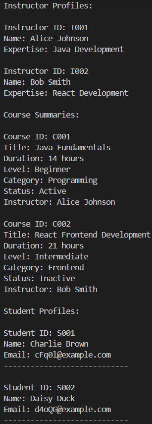
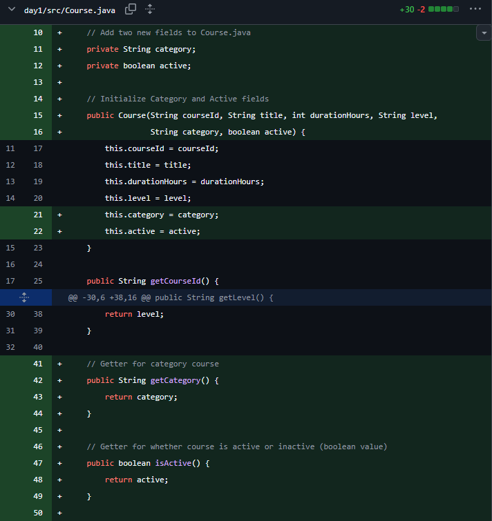
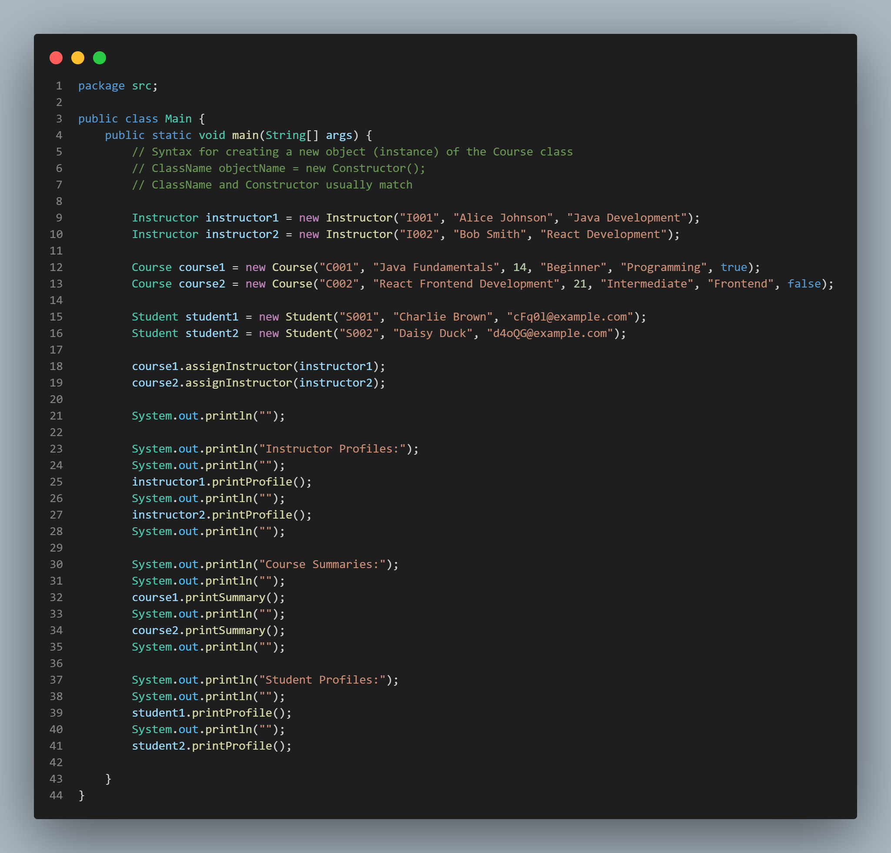

# Day 1 Exercise 02 - Improve Course Class

## 1. Updated Course Output (Screenshot Evidence)

Output shows:
- Category (e.g. Programming, Frontend)
- Status (Active / Inactive)

## 2. GitHub Commit Evidence

Commit message:
Add category and active fields in Course class

GitHub link:
https://github.com/raccocoon/NFS_JAVA_C2_2026-NUR-IFFAHHANA-SHABIRAH/commit/27551b519ea6a4a4e8350e4b35e9c74f0b76b509

- Add `category` and `active` field in `Course` class
- Update constructor with `category` and `active` field in `Course` class
- Update getter for `category` and `active` in `Course` class

- Update the `printSummary()` method with `category` and `active` field in `Course` class
- Update `Main` class with `category` and `active` status output

---

## 3. Brief Explanation of Changes in Course.java

**a.** I added two new fields in Course.java:
- category (type of course such as Programming, Frontend)
- active (status of course: Active or Inactive)

**b.** I updated the constructor to initialise these fields when creating a Course object with its getter.

**c.** I updated printSummary() to display category and convert boolean active into readable text (Active / Inactive instead of true / false)