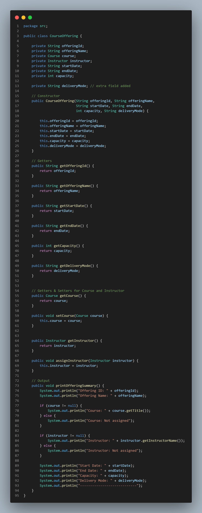
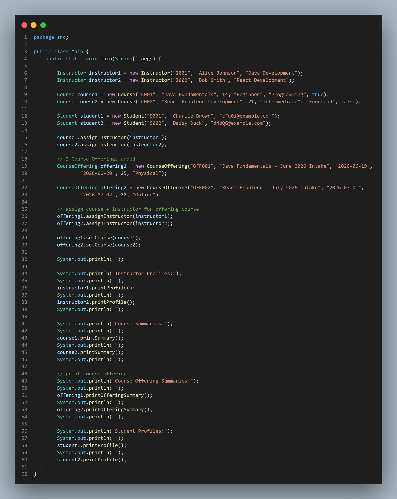

# Day 1 Exercise 03 - CourseOffering

## 1. CourseOffering.java Code Evidence

[View CourseOffering.java](../src/com/fullstack/demo/CourseOffering.java)

## 2. GitHub Commit Evidence

**a.** Commit message:
Add CourseOffering class with field needed and delivery mode as extra field

GitHub link:
https://github.com/raccocoon/NFS_JAVA_C2_2026-NUR-IFFAHHANA-SHABIRAH/commit/81e3f3d3b806ec2d6fccc30359cc52b4f49d5a69

- `CourseOffering` class added with fulfilled requirement needed

  
**b.** Commit message:
Add two course offerings

GitHub link:
https://github.com/raccocoon/NFS_JAVA_C2_2026-NUR-IFFAHHANA-SHABIRAH/commit/e2ffee9760fb2a72888bccf2fd103a556d4de4b6

- update `Main.java` with `CourseOffering` class

## 3. Brief Explanation of Why CourseOffering more useful

**a.** `CourseOffering` is more useful than using only `Course` because it allows the system to represent real scheduled instances of a course.

**b.** A `Course` only acts as a general template (for example: "Java Fundamentals"), while `CourseOffering` defines a real execution of that course with details such as start date, end date, capacity, instructor, and delivery mode.

**c.** This makes the system more realistic and scalable, because one `Course` can have multiple `CourseOfferings` for different intakes, similar to real learning platforms or university systems.

## 4. Short AI Reflection

**a.** I used AI to help me understand the difference between `Course` and `CourseOffering` and how to design the class structure.

**b.** AI also helped me understand how object relationships work between `Course`, `Instructor`, and `CourseOffering`.

**c.** I still verified the final code by running the program to ensure it works correctly and review other class code like `Course` to make sure I use the constructor, setter and getter correctly.
