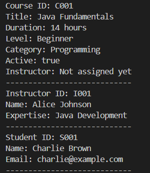

# Day 2 Exercise 01 - Clean up Model Classes

## 1. Updated Course.java

[View CourseOffering.java](../../day1/src/com/fullstack/demo/Course.java)

## 2. Updated Course.java

[View CourseOffering.java](../../day1/src/com/fullstack/demo/Instructor.java)

## 3. Updated Student.java

[View CourseOffering.java](../../day1/src/com/fullstack/demo/Student.java)

## 4. Working Output (Screenshot Evidence)

## 5. GitHub Commit Evidence

Commit message:
Clean Up Model Classes from Exercise 1

GitHub link:
https://github.com/raccocoon/NFS_JAVA_C2_2026-NUR-IFFAHHANA-SHABIRAH/commit/bfd399cd5a362c685c889721f0e3f494cdbd14f5

