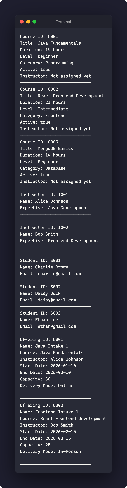

# Day 2 Exercise 01 - Clean up Model Classes

## 1. Updated Main.java

[View Main.java](../src/com/fullstack/demo/Main.java)

## 2. Screenshot showing all lists printed

## 3. GitHub Commit Evidence

Commit message:
Updated Main file

GitHub link:
https://github.com/raccocoon/NFS_JAVA_C2_2026-NUR-IFFAHHANA-SHABIRAH/commits/main/day2/src/com/fullstack/demo/Main.java

