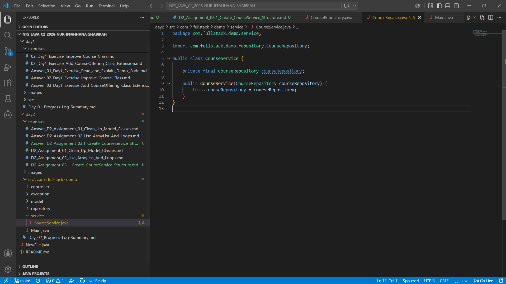

# Day 2 Exercise 03.1 - Create CourseService

## 1. Created `CourseService.java`

[View CourseService.java](../src/com/fullstack/demo/service/CourseService.java)

## 2. Screenshot showing compiled success

## 3. GitHub Commit Evidence

Commit message:
Create CourseService

GitHub link:
https://github.com/raccocoon/NFS_JAVA_C2_2026-NUR-IFFAHHANA-SHABIRAH/commit/48c2379a4849ca607e66e962050eee7afce2c2c6