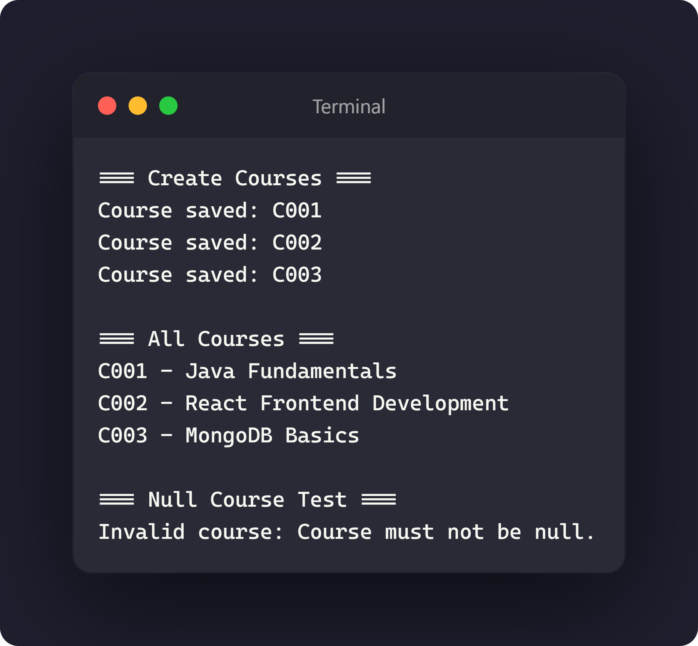

# Day 2 Exercise 03.2 - Create and List Courses

## 1. Updated `CourseService.java`

[View CourseService.java](../src/com/fullstack/demo/service/CourseService.java)

## 2. Created `CourseServiceDemo.java`

[View CourseServiceDemo.java](../src/com/fullstack/demo/CourseServiceDemo.java)

## 3. Screenshot showing output

## 4. GitHub Commit Evidence

**a.** Commit message:
Updated CourseService

GitHub link:
https://github.com/raccocoon/NFS_JAVA_C2_2026-NUR-IFFAHHANA-SHABIRAH/commit/0bd97485e8dd4cdd2f453757504d813b62e8cf52

**b.** Commit message:
Create CourseServiceDemo

GitHub link:
https://github.com/raccocoon/NFS_JAVA_C2_2026-NUR-IFFAHHANA-SHABIRAH/commit/037137da624850d15de0f1a927bb8f0af7f8562f
