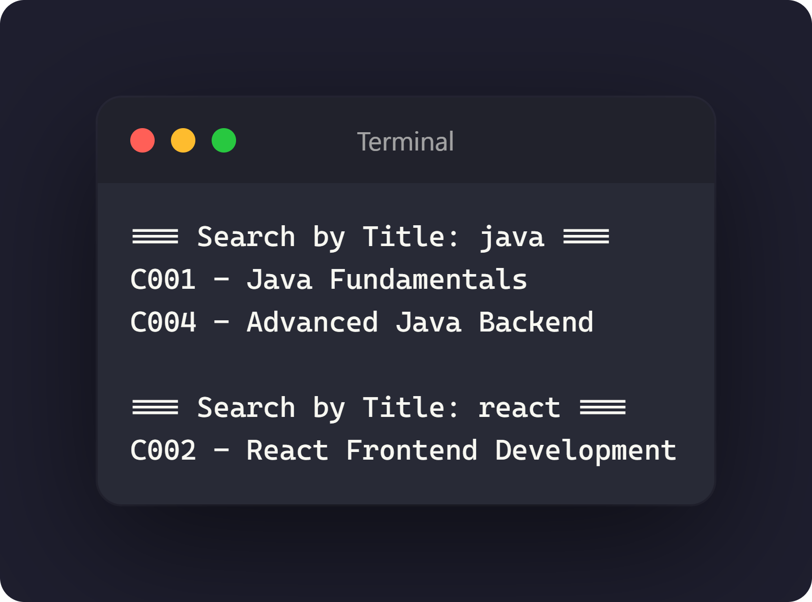
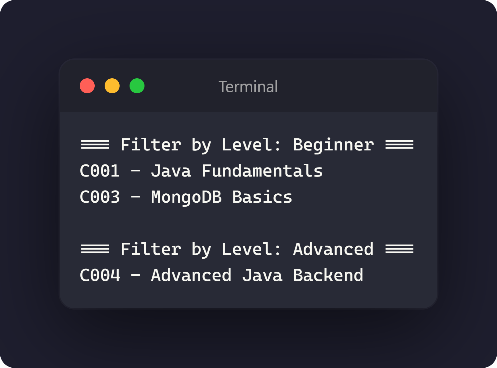

# Day 2 Assignment 03.4 - Search and Filter Courses

## 1. Updated `CourseService.java`

[View CourseService.java](../src/com/fullstack/demo/service/CourseService.java)

## 2. Updated `CourseServiceDemo.java`

[View CourseServiceDemo.java](../src/com/fullstack/demo/CourseServiceDemo.java)

## 3. Screenshot search output

## 4. Screenshot filter output

## 5. GitHub Commit Evidence

Commit message:
Updated CourseService and CourseServiceDemo Exercise 3.4

GitHub link:
https://github.com/raccocoon/NFS_JAVA_C2_2026-NUR-IFFAHHANA-SHABIRAH/commit/260a6de5a60363830cef095ad2d705c53d8f5076
