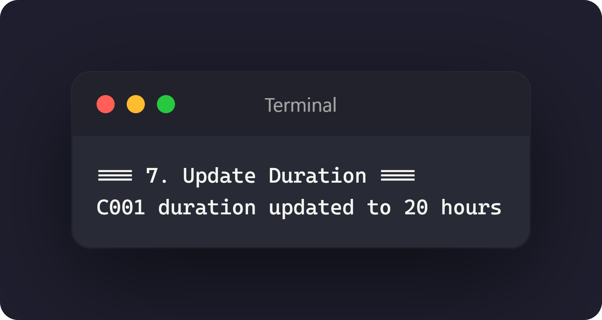
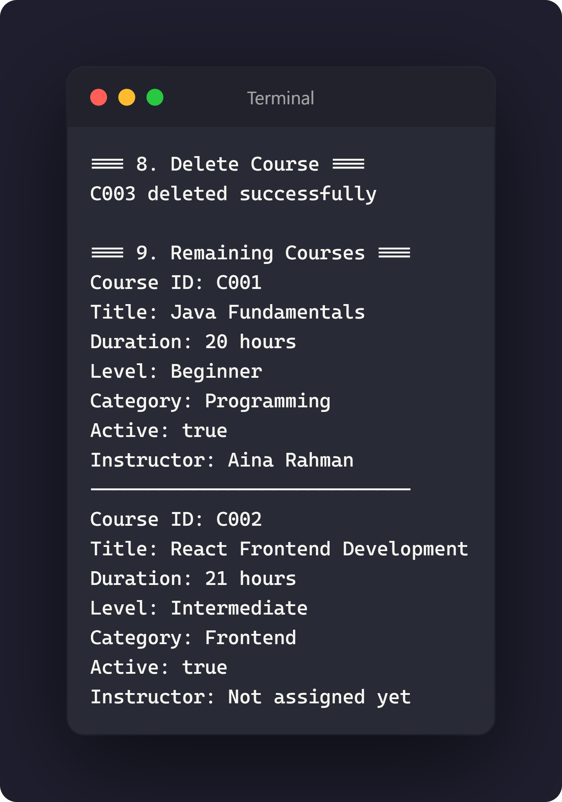
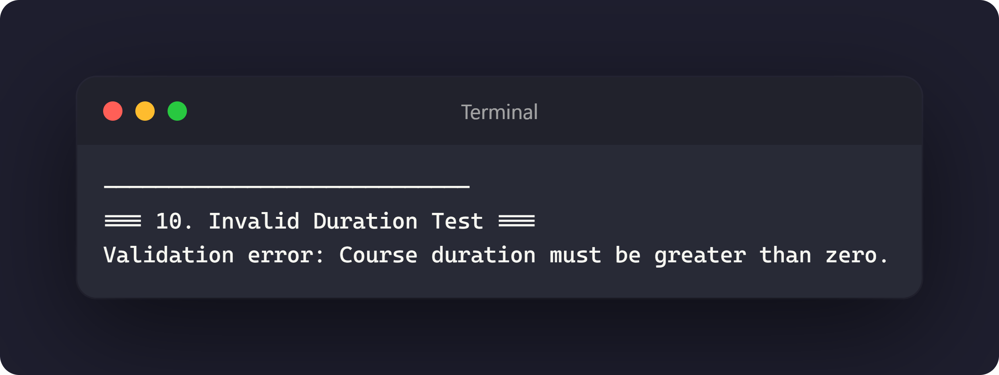

# Day 2 Assignment 03.6 - Update and Delete Courses

## 1. Completed `CourseService.java`

[View CourseService.java](../src/com/fullstack/demo/service/CourseService.java)

## 2. Completed `CourseServiceDemo.java`

[View CourseServiceDemo.java](../src/com/fullstack/demo/CourseServiceDemo.java)

## 3. Screenshot update output

## 4. Screenshot delete output

## 5. Screenshot exception output

## 6. GitHub Commit Evidence

Commit message:
Completed CourseService and CourseServiceDemo Exercise 3.6

GitHub link:
https://github.com/raccocoon/NFS_JAVA_C2_2026-NUR-IFFAHHANA-SHABIRAH/commit/60d7138ab386e15f5a3970aa2cbb0863a9548a43
